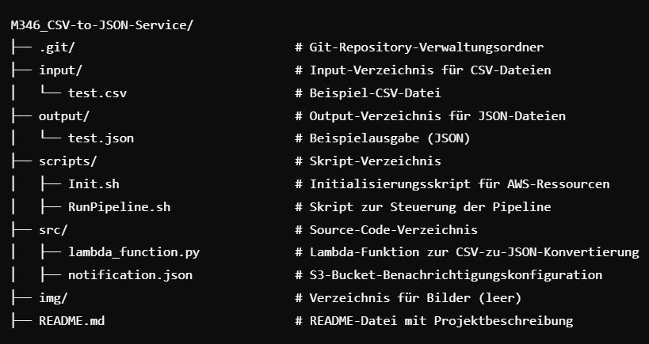

# Projektarbeit M346
**Autor:** Jahja, Alaaddin, Merdijan  

**Version:** 1.0.6

**Datum:** 17.12.2024

**Beschreibung:** CSV to JSON Converter with AWS Cloud  

## Inhaltsverzeichnis
- [Einführung](#einführung)
- [Features](#features)
- [Installationsanleitung](#installationsanleitung)
  - [Systemanforderungen](#systemanforderungen)
  - [Installationsschritte](#installationsschritte)
  - [Erste Schritte nach der Installation](#erste-schritte-nach-der-installation)
- [Anwendung](#anwendung)
- [Reflexionen](#reflexionen)
  - [Jahja Ajredini](#jahja-ajredini)
  - [Merdijan Nuhija](#merdijan-nuhija)
  - [Alaaddin Karakoyun](#alaaddin-karakoyun)
- [FAQ](#faq)
  - [Frage 1: Welche AWS-Ressourcen werden erstellt?](#frage-1-welche-aws-ressourcen-werden-erstellt)
  - [Frage 2: Wie kann ich die Ressourcen löschen?](#frage-2-wie-kann-ich-die-ressourcen-löschen)
  - [Frage 3: Was passiert, wenn eine CSV-Datei bereits im Input-Bucket vorhanden ist?](#frage-3-was-passiert-wenn-eine-csv-datei-bereits-im-input-bucket-vorhanden-ist)
  - [Frage 4: Kann ich andere Dateiformate als CSV verwenden?](#frage-4-kann-ich-andere-dateiformate-als-csv-verwenden)
  - [Frage 5: Kann ich die Timeout-Einstellungen ändern?](#frage-5-kann-ich-die-timeout-einstellungen-ändern)
  - [Frage 6: Ich sehe keine JSON-Datei im Output-Bucket. Was soll ich tun?](#frage-6-ich-sehe-keine-json-datei-im-output-bucket-was-soll-ich-tun)
  - [Frage 7: Kann ich die Region ändern?](#frage-7-kann-ich-die-region-ändern)
  - [Frage 8: Gibt es Einschränkungen für die Größe der CSV-Datei?](#frage-8-gibt-es-einschränkungen-für-die-größe-der-csv-datei)
  - [Frage 9: Kann ich mehrere CSV-Dateien gleichzeitig verarbeiten?](#frage-9-kann-ich-mehrere-csv-dateien-gleichzeitig-verarbeiten)
  - [Frage 10: Was mache ich, wenn das Skript nicht funktioniert?
](#frage-10-was-mache-ich-wenn-das-skript-nicht-funktioniert)
- [Kontakt](#kontakt)

---

## Einführung in das Projekt "CSVTOJSON"

Das Projekt „CSVTOJSON“ hat zum Ziel, eine innovative Lösung zu entwickeln, die die Umwandlung von CSV-Dateien in JSON-Dateien schnell und einfach ermöglicht. In einer Welt, die zunehmend auf die Verwendung spezifischer Dateiformate angewiesen ist, wächst die Nachfrage nach spezialisierten Konvertierungsprogrammen. Das Projekt richtet sich an technikaffine Anwender, die eine unkomplizierte und effiziente Möglichkeit suchen, ihre Datenformate zu konvertieren. Durch den Einsatz von S3 Buckets und einer Lambda-Funktion in einem Skript, das mit nur einem einfachen Aufruf ausgeführt werden kann, wird eine benutzerfreundliche und automatisierte Lösung geschaffen, die einen reibungslosen Ablauf gewährleistet.

---

## Features

- **Automatische CSV-Verarbeitung:** CSV-Dateien, die in den Input-Bucket hochgeladen werden, werden automatisch verarbeitet und in JSON-Dateien konvertiert.
- **Serverlose Architektur:** Das Projekt nutzt AWS Lambda, um eine kosteneffiziente und skalierbare Lösung bereitzustellen.
- **Einfache Installation und Nutzung:** Mit klaren Anleitungen und Shell-Skripten wird die Einrichtung und Nutzung für den Anwender erleichtert.
- **Flexibilität:** Das Skript ermöglicht Anpassungen wie das Ändern der Timeout-Dauer oder der AWS-Region.
- **Ressourcenverwaltung:** Einfaches Erstellen und Löschen von AWS-Ressourcen durch integrierte Skripte.

---

## Installationsanleitung

### Systemanforderungen

Bevor Sie das Projekt installieren, stellen Sie sicher, dass Ihr System die folgenden Anforderungen erfüllt:

- Betriebssystem: Linux, macOS oder Windows (mit WSL2 empfohlen)
- AWS CLI: Version 2.x installiert und konfiguriert
- Python: Version 3.8 oder höher
- Bash: Für die Ausführung der Skripte
- AWS IAM Rolle: Eine bestehende IAM-Rolle mit den erforderlichen Berechtigungen (LabRole)
- AWS-Account: Zugriff auf einen AWS-Account mit Administratorrechten
- S3 Berechtigungen: Berechtigungen zum Erstellen und Löschen von S3-Buckets
-  Lambda Berechtigungen: Berechtigungen zum Erstellen und Verwalten von Lambda-Funktionen

Beachte, dass die File-Hierarchie folgendermassen aussieht:



**Hinweis**: Der Ordner ``img/`` ist hier leer aber er wird für Screenshots oder Dokumentationsbilder verwendet.

<br>

### Installationsschritte

1. **AWS CLI konfigurieren**: Stellen Sie sicher, dass die AWS CLI auf Ihrem System installiert und konfiguriert ist:
```bash
aws configure
```
Geben Sie Ihre **AWS-Access-Key-ID**, **AWS-Secret-Access-Key**, **Region (z. B. us-east-1)**, und das gewünschte Ausgabeformat (z. B. json) ein.

<br>

2. **Projektverzeichnis vorbereiten**: Klonen Sie das Projekt oder laden Sie es herunter:
```bash
git clone https://github.com/jahja08/M346_CSV-to-JSON-Service.git
# Navigiere zum Projektordner
cd M346_CSV-to-JSON-Service
```

<br>

3. **Initialisierung ausführen**: Führen Sie das Initialisierungsskript aus, um die erforderlichen AWS-Ressourcen zu erstellen:
```bash
# Datei ausführbar machen (Berechtigungen)
chmod +x scripts/Init.sh
# Führt das Skript aus.
./scripts/Init.sh <AWS_ACCOUNT_ID>
```
**Hinweis:** Ersetzen Sie **<AWS_ACCOUNT_ID>** durch Ihre AWS-Account ID.

Das Skript führt folgende Aktionen durch:
- Erstellen von S3-Buckets (Eingangs- und Ausgangsbuckets).
- Erstellen und Konfigurieren einer Lambda-Funktion für die CSV-zu-JSON-Konvertierung.
- Hinzufügen von S3-Bucket-Benachrichtigungen zur Lambda-Funktion.

---

## Anwendung

1. **CSV-Datei vorbereiten**: Platzieren Sie eine CSV-Datei (z. B. ``test.csv``) im Ordner ``input``.

<br>

2. **Pipeline ausführen**: Starten Sie die Pipeline mit dem Skript ``RunPipeline.sh``:

```bash
# Datei ausführbar machen (Berechtigungen)
chmod +x scripts/RunPipeline.sh
# Führt das Skript  aus.
./scripts/RunPipeline.sh <IN_BUCKET> <OUT_BUCKET> <LAMBDA_FUNCTION_NAME>
```
**Hinweis**: Ersetzen Sie **<IN_BUCKET>**, **<OUT_BUCKET>** und **<LAMBDA_FUNCTION_NAME>** durch die Werte, die im Initialisierungsskript ausgegeben wurden.

<br>

3. **Ausgabe der JSON Datei**: Nun solltest du Die JSON Datei im Output-Ordner drin haben uns sie sollte heruntergeladen sein.

<br>

4. **Ressourcenverwaltung** (optional):
- Ressourcen löschen: Falls die Ressourcen nicht mehr benötigt werden, können sie mit dem Skript ``RunPipeline.sh`` entfernt werden. Sie werden dazu am Ende des Skripts gefragt.
- Manuelle Steuerung: Falls Sie die Ressourcen behalten möchten, notieren Sie sich die ausgegebenen Werte von ``IN_BUCKET``, ``OUT_BUCKET``, und ``LAMBDA_FUNCTION_NAME``.

---

## Testen des Skripts


---

## Reflexionen

### Jahja Ajredini

<!-- Reflexion -->

<br>

### Merdijan Nuhija

<!-- Reflexion -->

<br>

### Alaaddin Karakoyun

<!-- Reflexion -->

---

## FAQ

### Frage 1: Welche AWS-Ressourcen werden erstellt?
- Zwei S3-Buckets (Input und Output).
- Eine Lambda-Funktion zur CSV-zu-JSON-Konvertierung.
- Ein S3-Trigger, der die Lambda-Funktion automatisch auslöst.

### Frage 2: Wie kann ich die Ressourcen löschen?
- Führen Sie das Skript ``RunPipeline.sh`` aus, und wählen Sie ``y``, wenn Sie gefragt werden, ob die Ressourcen gelöscht werden sollen.
- Alternativ können Sie die Ressourcen manuell mit den folgenden Befehlen löschen:
```bash
aws s3 rb s3://<IN_BUCKET> --force
aws s3 rb s3://<OUT_BUCKET> --force
aws lambda delete-function --function-name <LAMBDA_FUNCTION_NAME>
```

### Frage 3: Was passiert, wenn eine CSV-Datei bereits im Input-Bucket vorhanden ist?
- Die vorhandene Datei wird erneut verarbeitet. Es wird jedoch empfohlen, eine eindeutige Namenskonvention für Ihre Dateien zu verwenden, um Überschreibungen zu vermeiden.

### Frage 4: Kann ich andere Dateiformate als CSV verwenden?
- Nein, derzeit unterstützt die Software nur CSV-Dateien.

### Frage 5: Kann ich die Timeout-Einstellungen ändern?
- Ja, die Timeout-Dauer kann in der Variable ``TIMEOUT`` im ``Init.sh``-Skript geändert werden

### Frage 6: Ich sehe keine JSON-Datei im Output-Bucket. Was soll ich tun?
- Überprüfen Sie, ob:
  
  - Die CSV-Datei korrekt hochgeladen wurde.
  - Die Lambda-Funktion erfolgreich ausgeführt wurde. Sie können die Protokolle in AWS CloudWatch überprüfen.
  - Die Berechtigungen für den Output-Bucket korrekt sind.

### Frage 7: Kann ich die Region ändern?
- Ja, die Region wird in der Variable ``REGION`` im ``Init.sh``-Skript festgelegt. Ändern Sie diese, bevor Sie das Skript ausführen.

### Frage 8: Gibt es Einschränkungen für die Größe der CSV-Datei?
- Ja, die Dateigröße darf die maximal zulässige Payload-Größe für Lambda (6 MB direkt oder 10 MB für S3-getriggerte Events) nicht überschreiten.

### Frage 9: Kann ich mehrere CSV-Dateien gleichzeitig verarbeiten?
- Ja, alle CSV-Dateien, die in den Input-Bucket hochgeladen werden, werden automatisch verarbeitet. Beachten Sie jedoch die Beschränkungen von Lambda.

### Frage 10: Was mache ich, wenn das Skript nicht funktioniert?
- Überprüfen Sie die Fehlermeldung und stellen Sie sicher, dass:

  - Alle Systemanforderungen erfüllt sind.
  - Die AWS CLI korrekt konfiguriert ist.
  - Die IAM-Rolle die erforderlichen Berechtigungen hat.

---

## Kontakt

Wenn du weitere Fragen hast, kontaktiere uns unter:

- **E-Mail Alaaddin Karakoyun:** [Alaaddin.Karakoyun@edu.gbssg.ch](mailto:Alaaddin.Karakoyun@edu.gbssg.ch)
- **E-Mail Jahja Ajredini:** [Jahja.Ajredini@edu.gbssg.ch](mailto:Jahja.Ajredini@edu.gbssg.ch)
- **E-Mail Merdijan Nuhija:** [Merdijan.Nuhija@edu.gbssg.ch](mailto:Merdijan.Nuhija@edu.gbssg.ch)
