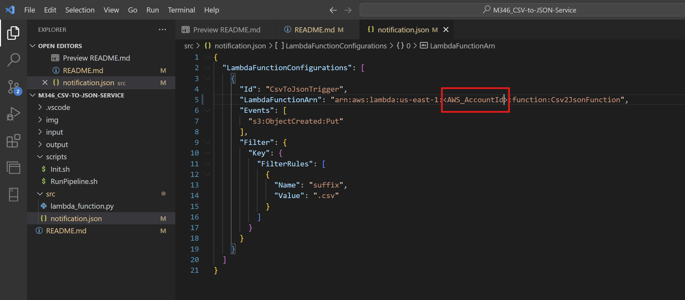
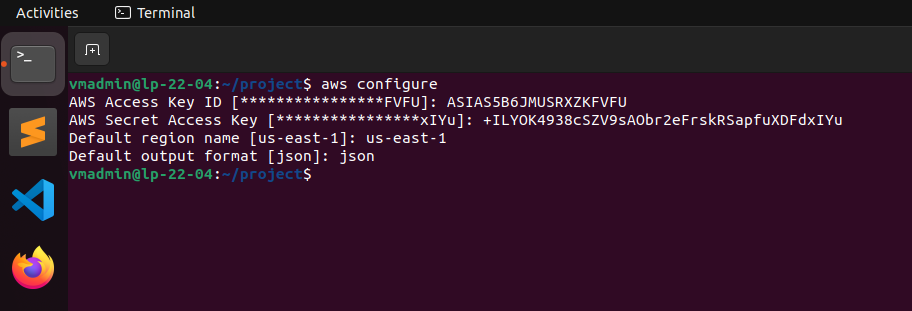
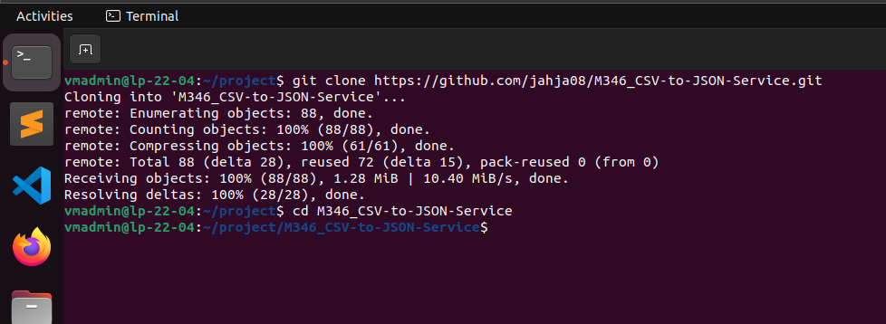
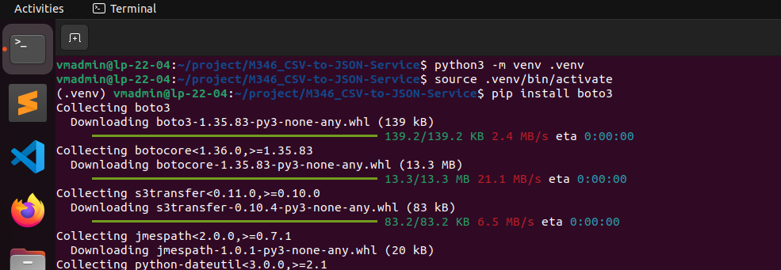
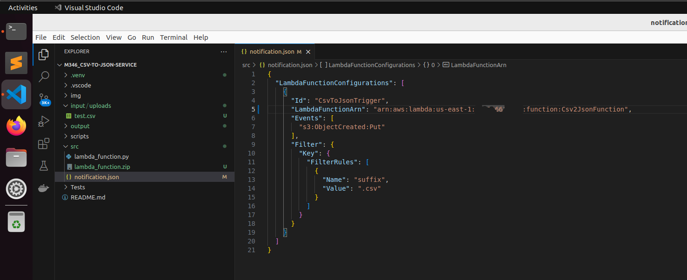
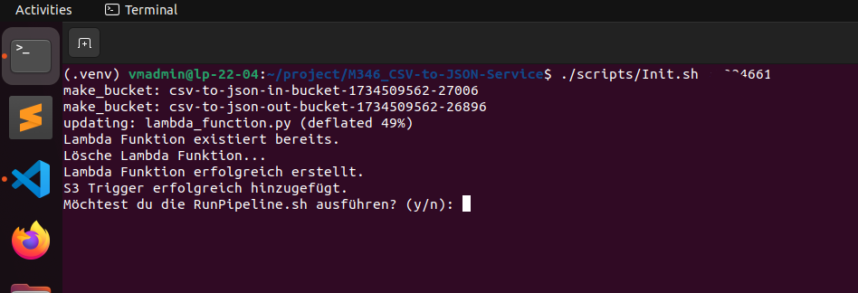
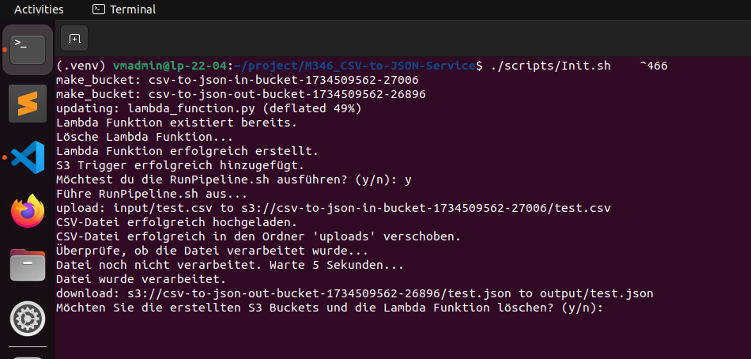
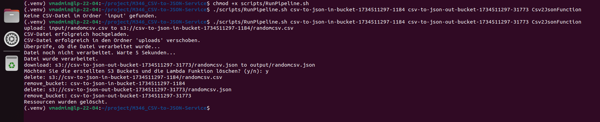

# Projektarbeit M346
**Autor:** Jahja, Alaaddin, Merdijan  

**Version:** 1.0.6

**Datum:** 17.12.2024

**Beschreibung:** CSV to JSON Converter with AWS Cloud  

## Inhaltsverzeichnis
- [Projektarbeit M346](#projektarbeit-m346)
  - [Inhaltsverzeichnis](#inhaltsverzeichnis)
  - [Einführung in das Projekt "CSVTOJSON"](#einführung-in-das-projekt-csvtojson)
  - [Features](#features)
  - [Installationsanleitung](#installationsanleitung)
    - [Systemanforderungen](#systemanforderungen)
    - [Installationsschritte](#installationsschritte)
  - [Anwendung](#anwendung)
  - [Testen des Skripts](#testen-des-skripts)
        - [Alaaddin Karakoyun 18.12.2024](#alaaddin-karakoyun-18122024)
      - [1. AWS Konfigurieren](#1-aws-konfigurieren)
      - [2. Das Projektverzeichnis klonen und vorbereiten](#2-das-projektverzeichnis-klonen-und-vorbereiten)
      - [3.1 Installation python-venv3](#31-installation-python-venv3)
      - [3.2 Installation boto3](#32-installation-boto3)
      - [4. Datei "notification.json" anpassen](#4-datei-notificationjson-anpassen)
      - [5. Erster Skript "init.sh" ausführen](#5-erster-skript-initsh-ausführen)
      - [6. Fall 1: Runpipeline.sh direkt nach Initialisierung ausführen](#6-fall-1-runpipelinesh-direkt-nach-initialisierung-ausführen)
      - [6. Fall 2: Runpipeline.sh selber ausführen](#6-fall-2-runpipelinesh-selber-ausführen)
  - [Reflexionen](#reflexionen)
    - [Jahja Ajredini](#jahja-ajredini)
    - [Merdijan Nuhija](#merdijan-nuhija)
    - [Alaaddin Karakoyun](#alaaddin-karakoyun)
  - [FAQ](#faq)
    - [Frage 1: Welche AWS-Ressourcen werden erstellt?](#frage-1-welche-aws-ressourcen-werden-erstellt)
    - [Frage 2: Wie kann ich die Ressourcen löschen?](#frage-2-wie-kann-ich-die-ressourcen-löschen)
    - [Frage 3: Was passiert, wenn eine CSV-Datei bereits im Input-Bucket vorhanden ist?](#frage-3-was-passiert-wenn-eine-csv-datei-bereits-im-input-bucket-vorhanden-ist)
    - [Frage 4: Kann ich andere Dateiformate als CSV verwenden?](#frage-4-kann-ich-andere-dateiformate-als-csv-verwenden)
    - [Frage 5: Kann ich die Timeout-Einstellungen ändern?](#frage-5-kann-ich-die-timeout-einstellungen-ändern)
    - [Frage 6: Ich sehe keine JSON-Datei im Output-Bucket. Was soll ich tun?](#frage-6-ich-sehe-keine-json-datei-im-output-bucket-was-soll-ich-tun)
    - [Frage 7: Kann ich die Region ändern?](#frage-7-kann-ich-die-region-ändern)
    - [Frage 8: Gibt es Einschränkungen für die Größe der CSV-Datei?](#frage-8-gibt-es-einschränkungen-für-die-größe-der-csv-datei)
    - [Frage 9: Kann ich mehrere CSV-Dateien gleichzeitig verarbeiten?](#frage-9-kann-ich-mehrere-csv-dateien-gleichzeitig-verarbeiten)
    - [Frage 10: Was mache ich, wenn das Skript nicht funktioniert?](#frage-10-was-mache-ich-wenn-das-skript-nicht-funktioniert)
  - [Kontakt](#kontakt)

---

## Einführung in das Projekt "CSVTOJSON"

Das Projekt „CSVTOJSON“ hat zum Ziel, eine innovative Lösung zu entwickeln, die die Umwandlung von CSV-Dateien in JSON-Dateien schnell und einfach ermöglicht. In einer Welt, die zunehmend auf die Verwendung spezifischer Dateiformate angewiesen ist, wächst die Nachfrage nach spezialisierten Konvertierungsprogrammen. Das Projekt richtet sich an technikaffine Anwender, die eine unkomplizierte und effiziente Möglichkeit suchen, ihre Datenformate zu konvertieren. Durch den Einsatz von S3 Buckets und einer Lambda-Funktion in einem Skript, das mit nur einem einfachen Aufruf ausgeführt werden kann, wird eine benutzerfreundliche und automatisierte Lösung geschaffen, die einen reibungslosen Ablauf gewährleistet.

---

## Features

- **Automatische CSV-Verarbeitung:** CSV-Dateien, die in den Input-Bucket hochgeladen werden, werden automatisch verarbeitet und in JSON-Dateien konvertiert.
- **Serverlose Architektur:** Das Projekt nutzt AWS Lambda, um eine kosteneffiziente und skalierbare Lösung bereitzustellen.
- **Einfache Installation und Nutzung:** Mit klaren Anleitungen und Shell-Skripten wird die Einrichtung und Nutzung für den Anwender erleichtert.
- **Flexibilität:** Das Skript ermöglicht Anpassungen wie das Ändern der Timeout-Dauer oder der AWS-Region.
- **Ressourcenverwaltung:** Einfaches Erstellen und Löschen von AWS-Ressourcen durch integrierte Skripte.

---

## Installationsanleitung

### Systemanforderungen

Bevor Sie das Projekt installieren, stellen Sie sicher, dass Ihr System die folgenden Anforderungen erfüllt:

- Betriebssystem: Linux, macOS oder Windows (mit WSL2 empfohlen)
- AWS CLI: Version 2.x installiert und konfiguriert
- Python: Version 3.8 oder höher
- Bash: Für die Ausführung der Skripte
- AWS IAM Rolle: Eine bestehende IAM-Rolle mit den erforderlichen Berechtigungen (LabRole)
- AWS-Account: Zugriff auf einen AWS-Account mit Administratorrechten
- S3 Berechtigungen: Berechtigungen zum Erstellen und Löschen von S3-Buckets
-  Lambda Berechtigungen: Berechtigungen zum Erstellen und Verwalten von Lambda-Funktionen

Beachte, dass die File-Hierarchie folgendermassen aussieht:


**Hinweis**: Der Ordner ``img/`` ist hier leer aber er wird für Screenshots oder Dokumentationsbilder verwendet.

<br>

### Installationsschritte

1. **AWS CLI konfigurieren**: Stellen Sie sicher, dass die AWS CLI auf Ihrem System installiert und konfiguriert ist:
```bash
aws configure
```
Geben Sie Ihre **AWS-Access-Key-ID**, **AWS-Secret-Access-Key**, **Region (z. B. us-east-1)**, und das gewünschte Ausgabeformat (z. B. json) ein.

<br>

2. **Projektverzeichnis vorbereiten**: Klonen Sie das Projekt oder laden Sie es herunter:
```bash
git clone https://github.com/jahja08/M346_CSV-to-JSON-Service.git
# Navigiere zum Projektordner
cd M346_CSV-to-JSON-Service
```

<br>

3. **Pip install ausführen**: Installieren Sie mit den folgenden Commands boto3:
```bash
sudo apt-get update
sudo apt-get install python3-venv
python3 -m venv .venv
# Aktiviere die Virtuelle Environment
source .venv/bin/activate
# installieren
pip install boto3
```

<br>

4. **notification.json ändern**: Ersetzen sie Folgendes mit ihrem AWSAccountId:
<br>
Unter M346_CSV-to-JSON-Service/src/notification.json ändern Sie die folgende Zeile:
<br>
<br>
"LambdaFunctionArn": "arn:aws:lambda:us-east-1:**<AWS_AccountId>**:function:Csv2JsonFunction", 
<br>
<br>
Ersetzen Sie **<AWS_AccountId>** mit ihrem eigenen Aws_AccountId
<br>


<br>
<br>
5. **Initialisierung ausführen**: Führen Sie das Initialisierungsskript aus, um die erforderlichen AWS-Ressourcen zu erstellen:
```bash
# Datei ausführbar machen (Berechtigungen)
chmod +x scripts/Init.sh
# Führt das Skript aus.
./scripts/Init.sh <AWS_ACCOUNT_ID>
```
**Hinweis:** Ersetzen Sie **<AWS_ACCOUNT_ID>** durch Ihre AWS-Account ID.

Das Skript führt folgende Aktionen durch:
- Erstellen von S3-Buckets (Eingangs- und Ausgangsbuckets).
- Erstellen und Konfigurieren einer Lambda-Funktion für die CSV-zu-JSON-Konvertierung.
- Hinzufügen von S3-Bucket-Benachrichtigungen zur Lambda-Funktion.

---

## Anwendung

1. **CSV-Datei vorbereiten**: Platzieren Sie eine CSV-Datei (z. B. ``test.csv``) im Ordner ``input``.

<br>

2. **Pipeline ausführen**: Starten Sie die Pipeline mit dem Skript ``RunPipeline.sh``:

```bash
# Datei ausführbar machen (Berechtigungen)
chmod +x scripts/RunPipeline.sh
# Führt das Skript  aus.
./scripts/RunPipeline.sh <IN_BUCKET> <OUT_BUCKET> <LAMBDA_FUNCTION_NAME>
```
**Hinweis**: Ersetzen Sie **<IN_BUCKET>**, **<OUT_BUCKET>** und **<LAMBDA_FUNCTION_NAME>** durch die Werte, die im Initialisierungsskript ausgegeben wurden.

<br>

3. **Ausgabe der JSON Datei**: Nun solltest du Die JSON Datei im Output-Ordner drin haben uns sie sollte heruntergeladen sein.

<br>

4. **Ressourcenverwaltung** (optional):
- Ressourcen löschen: Falls die Ressourcen nicht mehr benötigt werden, können sie mit dem Skript ``RunPipeline.sh`` entfernt werden. Sie werden dazu am Ende des Skripts gefragt.
- Manuelle Steuerung: Falls Sie die Ressourcen behalten möchten, notieren Sie sich die ausgegebenen Werte von ``IN_BUCKET``, ``OUT_BUCKET``, und ``LAMBDA_FUNCTION_NAME``.

---

## Testen des Skripts
##### Alaaddin Karakoyun 18.12.2024
<br>

#### 1. AWS Konfigurieren



Zunächst konfigurieren wir unser AWS Learner Lab mit unserer VM. Dabei sind folgende Daten anzugeben:
- aws_access_key_id
- aws_secret_access_key
- Default region name
- Default output format

<br>
<br>

#### 2. Das Projektverzeichnis klonen und vorbereiten



Im nächsten Schritt haben wir das Repository mit dem Befehl geklont: <br>
```bash
git clone https://github.com/jahja08/M346_CSV-to-JSON-Service
```
Es ist wichtig zu beachten, dass man mit dem GitHub-Account angemeldet ist.

<br>
<br>


#### 3.1 Installation python-venv3

Um unser Python-Skript nutzen zu können, installieren wir das Paket python3-venv.
<br>

<br>
Stellen Sie sicher, dass Sie mit dem Netzwerk verbunden sind. Falls Sie auf einer VM arbeiten, 
sollte die Netzwerkeinstellung auf NAT eingestellt sein.

<br>
<br>

#### 3.2 Installation boto3

Im gleichen Schritt erfolgt auch die Installation eines weiteren Tools.




<br>
<br>


#### 4. Datei "notification.json" anpassen

Damit das Skript fehlerfrei mit den richtigen Angaben funktioniert, geben wir zunächst unsere AWS_AccountId in die Datei notification.json ein.


<br>
Im Beispiel ist die AWS_Account_Id aus Sicherheitsgründen zensiert. Nach der Bearbeitung 
ist die Datei notification.json angepasst und bereit für die Ausführung der Skripte.

<br>
<br>

#### 5. Erster Skript "init.sh" ausführen 

Jetzt können wir unser erstes Skript mit dem Namen init.sh ausführen. 
Dabei muss erneut unsere AWS_Account_Id angegeben werden, die im Beispiel aus Datenschutzgründen zensiert ist.



Dieses Skript erstellt zwei S3-Buckets: den Input-Bucket und den Output-Bucket. <br>
Zusätzlich wird die Lambda-Funktion bereitgestellt, sodass wir nun bereit sind, eine CSV-Datei in eine JSON-Datei zu konvertieren.
<br>
<br>


#### 6. Fall 1: Runpipeline.sh direkt nach Initialisierung ausführen

Im vorherigen Schritt werden zwei Testfälle vorbereitet. Im ersten Fall wird das Skript Runpipeline.sh 
direkt mit der Antwort 'y' (yes) ausgeführt. Dabei werden die benötigten Daten direkt übergeben, und die Datei im Input-Ordner wird konvertiert.



Am Schluss kann man die erzeugte Buckets und Lambda-Funktion löschen lassen.
Falls Sie vergessen haben, eine CSV-Datei in den Input-Ordner zu legen, schlägt das Skript fehl. 
In diesem Fall müssen Sie das Skript Runpipeline.sh manuell ausführen und die erforderlichen Daten selbst bereitstellen. 
Sie können jedoch auch direkt zum nächsten Schritt übergehen.
<br>
<br>

#### 6. Fall 2: Runpipeline.sh selber ausführen

Nach dem 5. Schritt lehnen wir die Ausführung von Runpipeline.sh mit der Angabe 'n' (no) ab. Anschließend führen wir das Skript Runpipeline.sh manuell aus.



```bash
chmod +x scripts/RunPipeline.sh
./scripts/RunPipeline.sh <IN_BUCKET> <OUT_BUCKET> <LAMBDA_FUNCTION_NAME>
```

Folgende Daten sind im Skript Runpipeline.sh anzugeben:
- Name Input-Bucket
- Name Output-Bucket
- Name Lambda-Funktion

Diese Daten werden nach der Initialisierung ausgegeben, können jedoch auch über die AWS Console Home abgerufen werden.


---

## Reflexionen

### Jahja Ajredini

Am Anfang der Gruppenarbeit war es noch sehr chaotisch. In der Gruppe gab es noch keine richtige Idee, wer was machen sollte und so verbrachten wir die ersten zwei Lektionen damit, unsere Computer vorzubereiten und die Aufgabe zu lesen. In der zweiten Woche war die Aufgabenverteilung immer noch nicht so richtig geklärt, da den anderen beiden immer noch vieles unklar war und so haben wir auch in der Zeitwoche nichts Gescheites hinbekommen. Auf das Repository welches wir alles commited haben, wurde von Alaaddin erstellt, Merdijan hat es sich zur Aufgabe gemacht, das README anzufangen. Alaaddin und ich haben daraufhin angefanden die Scripts herzustellen. Wir haben überall kleine Baustellen angefangen und hatten immer noch keine Ahnung, wer eigentlich was macht. Am Wochenende habe ich dann angefangen den Code selber zu schreiben und habe versucht das Ganze so gut wie möglich in ein neues Repository zu committen. Als ich dann tatsächlich den ganzen Code geschrieben hatte, habe ich versucht, den anderen beiden ihre Aufgaben zu geben. Alaaddin habe ich die Aufgabe gegeben das Ganze zu testen und das dann in das README zu schreiben. Merdijans Aufgabe war es, die ganze Dokumentation zu machen und sich mit Alaaddin auszutauschen, um die Dokumentation zu vervollständigen.

<br>
Fazit: <br>
Wir hatten zu lange keine richtige Aufteilung und wussten nicht, wie wir das Projekt aufteilen sollten. Ich hätte zu Beginn des Projektes alles in die Hand nehmen und die Aufgaben verteilen sollen. So musste ich in diesem Projekt vieles selbst machen, was eigentlich nicht der richtige Ansatz war. 

<br>

### Merdijan Nuhija

<!-- Reflexion -->

<br>

### Alaaddin Karakoyun

In diesem Projekt ging es darum, ein Repository zu erstellen, das als Service dient und CSV-Dateien
in JSON-Dateien konvertiert. Dabei wurden zwei S3-Buckets eingerichtet und eine Lambda-Funktion für 
die Konvertierung genutzt. Die CSV-Datei wird in den ersten Bucket hochgeladen, woraufhin die Lambda-Funktion 
ausgelöst wird. Diese konvertiert die CSV-Datei in eine JSON-Datei und speichert sie im zweiten Bucket.
<br>
Zu Beginn war ich unsicher, wie wir das Projekt umsetzen sollten, und habe mich intensiv darüber informiert. 
Dennoch war mir klar, welche Ressourcen und Technologien wir benötigen würden. Wir haben gemeinsam die Rollen 
im Team verteilt und uns über die Anforderungen und den Projektablauf ausgetauscht. Ursprünglich wollte ich die 
Konvertierungslogik selbst programmieren, aber nachdem Herr Früh uns bestätigte, dass wir Bibliotheken verwenden 
dürfen, wurde die Aufgabe einfacher, und ich habe mich anderen Aspekten des Projekts gewidmet.
<br>
Im Laufe des Projekts haben wir wöchentlich Fortschritte gemacht, sowohl bei der Dokumentation als auch bei 
der technischen Entwicklung. Dennoch gab es einige Missverständnisse, die wir klären mussten, z. B. Fragen wie: 
"Sollen die S3-Buckets nach Abschluss des Projekts gelöscht werden?" oder "Muss die Lambda-Funktion für jeden neuen 
Auftrag neu erstellt werden?" Solche Unklarheiten führten dazu, dass wir in der Schule langsamer vorankamen und auch zu 
Hause Zeit in das Projekt investieren mussten.
<br>
Trotz dieser Herausforderungen war die Zusammenarbeit im Team sehr positiv. Alle haben ihren Teil 
des Projekts übernommen und ihre Aufgaben zuverlässig erledigt. Wir haben uns gegenseitig unterstützt 
und konnten so gemeinsam gute Fortschritte erzielen. Besonders unser Teamleiter hat viel zum Erfolg des Projekts 
beigetragen. Ich schätze seine Arbeit und seinen Einsatz sehr.
<br>
Insgesamt bin ich zufrieden mit dem, was wir erreicht haben, und stolz auf mein Team. Das Projekt hat 
mir Spass gemacht, und ich würde gerne an einem ähnlichen Vorhaben erneut teilnehmen.

---

## FAQ

### Frage 1: Welche AWS-Ressourcen werden erstellt?
- Zwei S3-Buckets (Input und Output).
- Eine Lambda-Funktion zur CSV-zu-JSON-Konvertierung.
- Ein S3-Trigger, der die Lambda-Funktion automatisch auslöst.

### Frage 2: Wie kann ich die Ressourcen löschen?
- Führen Sie das Skript ``RunPipeline.sh`` aus, und wählen Sie ``y``, wenn Sie gefragt werden, ob die Ressourcen gelöscht werden sollen.
- Alternativ können Sie die Ressourcen manuell mit den folgenden Befehlen löschen:
```bash
aws s3 rb s3://<IN_BUCKET> --force
aws s3 rb s3://<OUT_BUCKET> --force
aws lambda delete-function --function-name <LAMBDA_FUNCTION_NAME>
```

### Frage 3: Was passiert, wenn eine CSV-Datei bereits im Input-Bucket vorhanden ist?
- Die vorhandene Datei wird erneut verarbeitet. Es wird jedoch empfohlen, eine eindeutige Namenskonvention für Ihre Dateien zu verwenden, um Überschreibungen zu vermeiden.

### Frage 4: Kann ich andere Dateiformate als CSV verwenden?
- Nein, derzeit unterstützt die Software nur CSV-Dateien.

### Frage 5: Kann ich die Timeout-Einstellungen ändern?
- Ja, die Timeout-Dauer kann in der Variable ``TIMEOUT`` im ``Init.sh``-Skript geändert werden

### Frage 6: Ich sehe keine JSON-Datei im Output-Bucket. Was soll ich tun?
- Überprüfen Sie, ob:
  
  - Die CSV-Datei korrekt hochgeladen wurde.
  - Die Lambda-Funktion erfolgreich ausgeführt wurde. Sie können die Protokolle in AWS CloudWatch überprüfen.
  - Die Berechtigungen für den Output-Bucket korrekt sind.

### Frage 7: Kann ich die Region ändern?
- Ja, die Region wird in der Variable ``REGION`` im ``Init.sh``-Skript festgelegt. Ändern Sie diese, bevor Sie das Skript ausführen.

### Frage 8: Gibt es Einschränkungen für die Größe der CSV-Datei?
- Ja, die Dateigröße darf die maximal zulässige Payload-Größe für Lambda (6 MB direkt oder 10 MB für S3-getriggerte Events) nicht überschreiten.

### Frage 9: Kann ich mehrere CSV-Dateien gleichzeitig verarbeiten?
- Ja, alle CSV-Dateien, die in den Input-Bucket hochgeladen werden, werden automatisch verarbeitet. Beachten Sie jedoch die Beschränkungen von Lambda.

### Frage 10: Was mache ich, wenn das Skript nicht funktioniert?
- Überprüfen Sie die Fehlermeldung und stellen Sie sicher, dass:

  - Alle Systemanforderungen erfüllt sind.
  - Die AWS CLI korrekt konfiguriert ist.
  - Die IAM-Rolle die erforderlichen Berechtigungen hat.

---

## Kontakt

Wenn du weitere Fragen hast, kontaktiere uns unter:

- **E-Mail Alaaddin Karakoyun:** [Alaaddin.Karakoyun@edu.gbssg.ch](mailto:Alaaddin.Karakoyun@edu.gbssg.ch)
- **E-Mail Jahja Ajredini:** [Jahja.Ajredini@edu.gbssg.ch](mailto:Jahja.Ajredini@edu.gbssg.ch)
- **E-Mail Merdijan Nuhija:** [Merdijan.Nuhija@edu.gbssg.ch](mailto:Merdijan.Nuhija@edu.gbssg.ch)
